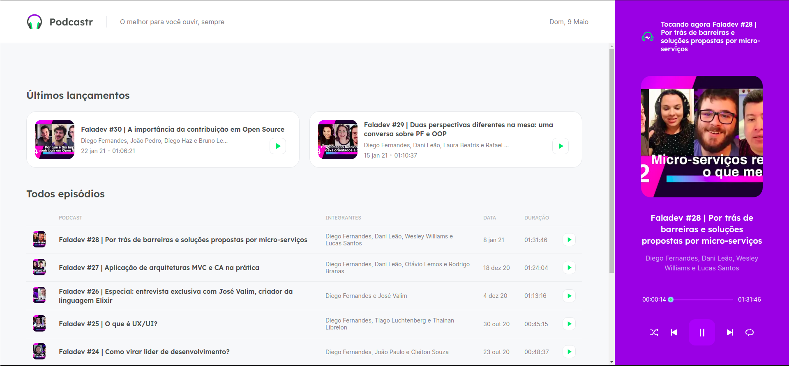

<h1 align="center">
      Podcastr
</h1>

<p align="center">
  

  
  <a href="https://github.com/lpaulovt/podcastr/commits/master">
    
  </a>

  <a href="https://github.com/lpaulovt/podcastr/issues">
    
  </a>

</p>

<h4 align="center">
 Listen podcasts about technologies can be more simples now!
</h4>

<p align="center">
  <a href="#rocket-technologies">Technologies</a>&nbsp;&nbsp;&nbsp;|&nbsp;&nbsp;&nbsp;
  <a href="#📦-install">Install</a>&nbsp;&nbsp;&nbsp;|&nbsp;&nbsp;&nbsp;
  <a href="#📦-install">How to use</a>&nbsp;&nbsp;&nbsp;|&nbsp;&nbsp;&nbsp;
  <a href="#memo-license">License</a>
</p>
<h1 align="center">
      
</h1>

## :rocket: Technologies

This project was developed at Rocketseat Next Level Week with the following technologies:

- [NextJS]()
- [Typescript]()
- [Axios]()
- [Date-fns]()
- [Rc-slider]()
- [Sass]()

### 📦 Install

```
$ git clone https://github.com/lpaulovt/podcastr.git

$ yarn install

```

### 🔨 How to use

Run project

```bash
$ yarn dev

$ yarn start

```

## :memo: License

This project is under the MIT license. See the [LICENSE](https://github.com/lpaulovt/dev-finance/blob/main/LICENSE) for more information.

---

Made with 🧡 by Paulo Lopes :wave: [Get in touch!](https://www.linkedin.com/in/lpaulovt/)
